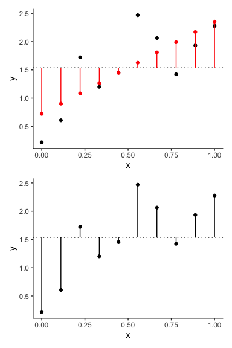
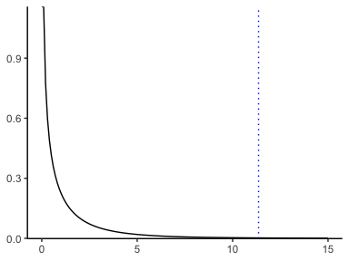

```r
set.seed(123)
theme_set(theme_classic())
```

# simple example


```r
N <- 10
a <- 2
b <- 0.5

dat <- 
  data.frame(x = seq(0, 1, length = N)) %>% 
  mutate(y = a * x + b + rnorm(N, mean = 0, sd = 0.5))
```


```r
g1 <-
  ggplot(data = dat) +
  aes(x = x, y = y) +
  geom_point()


g1
```

<!-- -->


```r
g1 +
  geom_smooth(method = "lm", se = F)
```

<!-- -->


<!-- -->

<!-- -->


```r
dat_lm <-
  dat %>% 
  lm(y ~ x, data = .)

dat_lm
```

```
## 
## Call:
## lm(formula = y ~ x, data = .)
## 
## Coefficients:
## (Intercept)            x  
##      0.7217       1.6311
```


```r
dat_lm %>% 
  names()
```

```
##  [1] "coefficients"  "residuals"     "effects"       "rank"         
##  [5] "fitted.values" "assign"        "qr"            "df.residual"  
##  [9] "xlevels"       "call"          "terms"         "model"
```

```r
dat_lm$coefficients
```

```
## (Intercept)           x 
##   0.7217481   1.6311295
```


```r
dat_lm %>% 
  summary()
```

```
## 
## Call:
## lm(formula = y ~ x, data = .)
## 
## Residuals:
##      Min       1Q   Median       3Q      Max 
## -0.56738 -0.28121 -0.06962  0.19268  0.84071 
## 
## Coefficients:
##             Estimate Std. Error t value Pr(>|t|)   
## (Intercept)   0.7217     0.2871   2.514  0.03613 * 
## x             1.6311     0.4839   3.371  0.00978 **
## ---
## Signif. codes:  0 '***' 0.001 '**' 0.01 '*' 0.05 '.' 0.1 ' ' 1
## 
## Residual standard error: 0.4884 on 8 degrees of freedom
## Multiple R-squared:  0.5868,	Adjusted R-squared:  0.5351 
## F-statistic: 11.36 on 1 and 8 DF,  p-value: 0.009778
```


```r
dat_lm %>% 
  summary() %>% 
  .$r.squared
```

```
## [1] 0.5867894
```


```r
extract_rsq <- function(lm_model){
  lm_model %>% 
    summary() %>% 
    .$r.squared
}

dat_lm %>% 
  extract_rsq
```

```
## [1] 0.5867894
```


```r
extract_p <- function(lm_model){
  f <-
    lm_model %>% 
    summary() %>% 
    .$fstatistic
  
  pf(f[1], f[2], f[3], lower.tail = F)
}

dat_lm %>% 
  extract_p()
```

```
##       value 
## 0.009777651
```


```r
dat_nest <-
  dat %>% 
  group_nest()

dat_nest
```

```
## # A tibble: 1 x 1
##   data             
##   <list>           
## 1 <df[,2] [10 × 2]>
```


```r
dat_nest %>% 
  mutate(lm = map(data, ~lm(y ~ x, data = .)))
```

```
## # A tibble: 1 x 2
##   data              lm    
##   <list>            <list>
## 1 <df[,2] [10 × 2]> <lm>
```


```r
dat_nest %>% 
  mutate(lm = map(data, ~lm(y ~ x, data = .)),
         a = map_dbl(lm, ~ .$coefficients[1]),
         b = map_dbl(lm, ~ .$coefficients[2]),
         rsq = map_dbl(lm, extract_rsq),
         pval = map_dbl(lm, extract_p),
         AIC = map_dbl(lm, AIC))
```

```
## # A tibble: 1 x 7
##   data              lm         a     b   rsq    pval   AIC
##   <list>            <list> <dbl> <dbl> <dbl>   <dbl> <dbl>
## 1 <df[,2] [10 × 2]> <lm>   0.722  1.63 0.587 0.00978  17.8
```


<!-- -->

<!-- -->


```r
.f <- dat_lm %>% summary() %>% .$fstatistic

data.frame(x = seq(0, 15, by = 0.1)) %>% 
  mutate(f = df(x, .f[2], .f[3])) %>% 
  ggplot()+
  aes(x, f)+
  geom_path()+
  geom_vline(xintercept = .f[1], color = "blue", linetype = "dotted")+
  scale_y_continuous(limits = c(0, NA), expand = c(0.001,0))+
  theme(axis.title = element_blank())
```

<!-- -->

```r
ggsave("fig/g8.png", width = 4, height = 3)
```


# penguins


```r
penguins
```

```
## # A tibble: 344 x 8
##    species island bill_length_mm bill_depth_mm flipper_length_… body_mass_g
##    <fct>   <fct>           <dbl>         <dbl>            <int>       <int>
##  1 Adelie  Torge…           39.1          18.7              181        3750
##  2 Adelie  Torge…           39.5          17.4              186        3800
##  3 Adelie  Torge…           40.3          18                195        3250
##  4 Adelie  Torge…           NA            NA                 NA          NA
##  5 Adelie  Torge…           36.7          19.3              193        3450
##  6 Adelie  Torge…           39.3          20.6              190        3650
##  7 Adelie  Torge…           38.9          17.8              181        3625
##  8 Adelie  Torge…           39.2          19.6              195        4675
##  9 Adelie  Torge…           34.1          18.1              193        3475
## 10 Adelie  Torge…           42            20.2              190        4250
## # … with 334 more rows, and 2 more variables: sex <fct>, year <int>
```


```r
penguins %>% 
  ggplot() +
  aes(species, flipper_length_mm, color = species)+
  geom_violin()+
  geom_jitter(alpha = 0.5, width = 0.05)+
  theme(legend.position = "none")
```

<!-- -->


```r
penguins_aov <-
  penguins %>% 
  aov(flipper_length_mm ~ species, data = .)

penguins_aov %>% 
  summary()
```

```
##              Df Sum Sq Mean Sq F value Pr(>F)    
## species       2  52473   26237   594.8 <2e-16 ***
## Residuals   339  14953      44                   
## ---
## Signif. codes:  0 '***' 0.001 '**' 0.01 '*' 0.05 '.' 0.1 ' ' 1
## 2 observations deleted due to missingness
```

```r
penguins %>% 
  lm(flipper_length_mm ~ species, data = .) %>% 
  summary()
```

```
## 
## Call:
## lm(formula = flipper_length_mm ~ species, data = .)
## 
## Residuals:
##      Min       1Q   Median       3Q      Max 
## -17.9536  -4.8235   0.0464   4.8130  20.0464 
## 
## Coefficients:
##                  Estimate Std. Error t value Pr(>|t|)    
## (Intercept)      189.9536     0.5405 351.454  < 2e-16 ***
## speciesChinstrap   5.8699     0.9699   6.052 3.79e-09 ***
## speciesGentoo     27.2333     0.8067  33.760  < 2e-16 ***
## ---
## Signif. codes:  0 '***' 0.001 '**' 0.01 '*' 0.05 '.' 0.1 ' ' 1
## 
## Residual standard error: 6.642 on 339 degrees of freedom
##   (2 observations deleted due to missingness)
## Multiple R-squared:  0.7782,	Adjusted R-squared:  0.7769 
## F-statistic: 594.8 on 2 and 339 DF,  p-value: < 2.2e-16
```


```r
penguins_xy <-
  penguins %>% 
  mutate(x = bill_length_mm,
         y = flipper_length_mm) %>% 
  filter(!is.na(x)) %>% 
  filter(!is.na(y))
```
